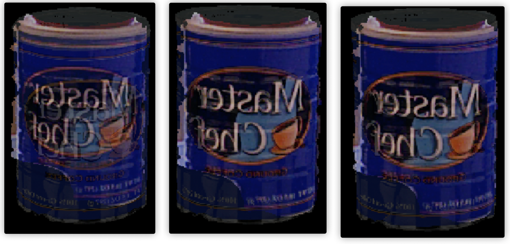
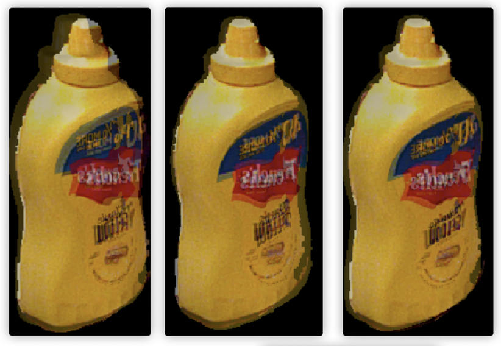

<!--
 * @Descripttion: densechen@foxmail.com
 * @version: 0.0
 * @Author: Dense Chen
 * @Date: 1970-01-01 08:00:00
 * @LastEditors: Dense Chen
 * @LastEditTime: 2020-08-12 21:45:08
-->
# Pose refinement with differentiable rendering

## Main Idea
We follow the main idea from [1] expect using differentiable renderer instead of original pre-render step. By differentiable renderer, we can chain each step to make a global refinement. 

You can refer to original paper for more details.

## Install
This project is based on PyTorch and pytorch3d. 
```
conda create -n pytorch3d python=3.8

conda activate pytorch3d
pip install -r requirement.txt
```

## Dataset
Please download the YCBDataset from [here](https://rse-lab.cs.washington.edu/projects/posecnn/), and modified the dataroot in 'settings/ycb.yaml:DATA_ROOT=YOUR DATA PATH'.

## Train
Run ```python tools/train.py``` to start a new train.

## Evaluation
We obey the evaluation step of [DenseFusion](https://github.com/j96w/DenseFusion). 
Run ```python test.py``` to generate the result, which can directly use for evaluation. The result will be saved under ```./result```, and has the same data structure with DenseFusion.

## Pretrained Model
We also provide a pretrained model, you can download them from 
(links: https://pan.baidu.com/s/1Wz_3A5fzDbT8Phc1QnGobw  passwd: igh7).

## Visualization of Refinement Result

<center class="half">
    
</center>

## Reference
[1] Li Y, Wang G, Ji X, et al. Deepim: Deep iterative matching for 6d pose estimation[C]//Proceedings of the European Conference on Computer Vision (ECCV). 2018: 683-698.

